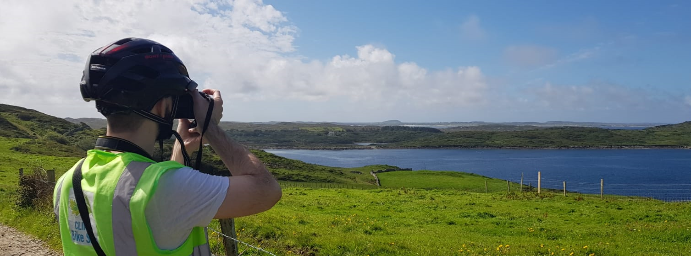

<h1 align="center">Hi there 👋🤠</h1>

## About me
👨‍💻 I am a Software Engineer with extensive experience on highly scalable distributed systems in domains such as **networking, publishing and e-commerce**.

🦾 During my career, I had the opportunity to work in some of the most customer focused companies in the world, which has made me a firm advocate for **sustainable and resilient products**.

👨‍🏫 I am a firm advocate for engineering excellence, which has led me to kick-off multiple initiatives to level-up my peers and teams such as **engineering practices, on-call retrospectives, brown-bag presentations, mentoring**.

---

## My tech stack

---

## My blog posts
- [Lessons learnt from my first mob programming session](https://dev.to/albertowar/lessons-learnt-from-my-first-mob-programming-session-5hjf)
---

    
    

    

